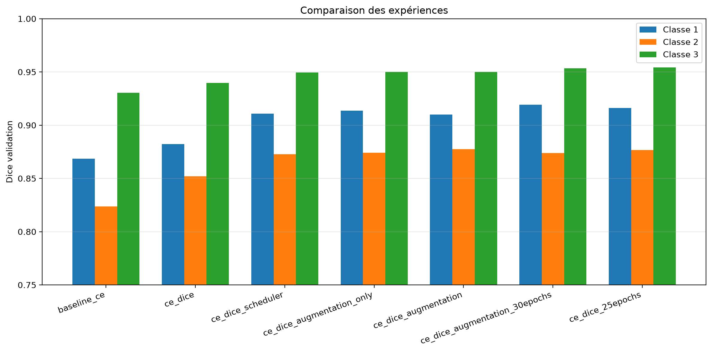
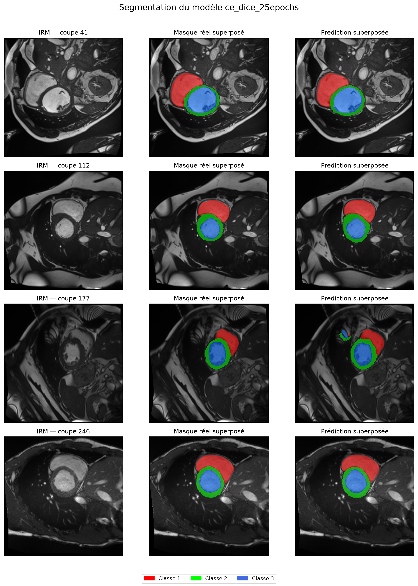

# Segmentation cardiaque avec U-Net

Projet de segmentation 2D d'IRM cardiaques avec un U-Net.

Le modèle prédit quatre classes pour chaque pixel : le fond et trois
structures cardiaques.

## Organisation

```text
.
├── data/
│   └── training/                 # Volumes et masques NIfTI
├── outputs/
│   └── experiments/              # Un dossier par expérience
├── scripts/
│   ├── data/                     # Inspection du dataset
│   ├── evaluation/               # Visualisation des prédictions
│   └── training/                 # Tests du pipeline d'entraînement
├── src/
│   ├── data/                     # Dataset
│   ├── metrics/                  # Métriques de segmentation
│   ├── models/                   # Architecture U-Net
│   ├── training/                 # Validation
│   └── config.py                 # Configuration 
└── train.py                      # Entraînement principal
```

## Installation

```bash
python -m venv .venv
source .venv/bin/activate
pip install -r requirements.txt
```

## Commandes

Toutes les commandes sont à lancer depuis la racine du projet.

Inspecter tout le dataset :

```bash
python -m scripts.data.inspect_dataset
```

Entraîner le modèle :

```bash
python train.py
```

Visualiser les prédictions du meilleur checkpoint :

```bash
python -m scripts.evaluation.visualize_predictions
```

Évaluer une seule fois le modèle final sur le test set :

```bash
python -m scripts.evaluation.evaluate_test
```

Lancer les tests :

```bash
python -m unittest discover -s tests
```

## Split
Le dataset peut être récupéré avec ce lien: https://www.creatis.insa-lyon.fr/Challenge/acdc/databasesTraining.html

Le split est réalisé au niveau patient afin d'éviter qu'un même patient
apparaisse dans plusieurs ensembles :

- 70 patients pour l'entraînement 
- 15 patients pour la validation 
- 15 patients pour le test 

Ces valeurs et les principaux hyperparamètres se trouvent dans
`src/config.py`.

## Suivi des expériences

Le nom de l'expérience active est défini avec `EXPERIMENT_NAME` dans
`src/config.py`. Chaque expérience enregistre automatiquement :

- `config.json` : hyperparamètres ;
- `history.csv` : métriques de chaque époque ;
- `summary.json` : meilleure époque de validation ;
- `curves.png` : courbes de loss et de Dice ;
- `best_model.pth` : meilleur checkpoint ;
- `test_metrics.json` : résultats de test, seulement si le script de test
  est lancé.

## Expériences

| Expérience | Configuration principale | Dice validation |
|---|---|---:|
| `baseline_ce` | Cross-Entropy, 10 époques, batch 8 | 0.8742 |
| `ce_dice` | Cross-Entropy + Dice, 10 époques, batch 8 | 0.8913 |
| `ce_dice_25epochs` | Cross-Entropy + Dice, 25 époques, batch 8 | **0.9157** |
| `ce_dice_scheduler` | Scheduler, 30 époques, batch 16 | 0.9110 |
| `ce_dice_augmentation` | Augmentation + scheduler, 30 époques, batch 16 | 0.9125 |

Le modèle final est `ce_dice_25epochs`, sélectionné uniquement avec les
résultats de validation.

## Résultats finaux

Le modèle final atteint les résultats suivants sur les 15 patients du
test set :

| Métrique | Dice |
|---|---:|
| Moyenne des trois classes | **0.9163** |
| Classe 1 | 0.9035 |
| Classe 2 | 0.8863 |
| Classe 3 | 0.9591 |

Sur les 15 patients du test, le Dice moyen calculé séparément par
patient est :

```text
0.9023 ± 0.0516
```

Le meilleur patient obtient `0.9549` et le cas le plus difficile
`0.7619`.

| Dice par patient | Moyenne ± écart-type |
|---|---:|
| Classe 1 | 0.8811 ± 0.0962 |
| Classe 2 | 0.8784 ± 0.0399 |
| Classe 3 | 0.9473 ± 0.0362 |

Les fichiers détaillés et les courbes sont disponibles dans
`outputs/experiments/`. 

### Comparaison des expériences



### Exemples de segmentation

Les couleurs représentent les trois classes cardiaques. La colonne
centrale montre la vérité terrain et la colonne de droite la prédiction.



## Données

Les données médicales ne sont pas incluses dans le repo. Elles doivent
être placées dans :

```text
data/training/patientXXX/
```

Chaque volume NIfTI doit être accompagné de son masque dont le nom se
termine par `_gt.nii.gz`.

## Limites

- **Attention U-Net** : ajouter des attention gates pour que le modèle se concentre sur les zones cardiaques et ignore le fond
- **U-Net 3D** : exploiter la dimension spatiale des volumes IRM plutôt que de traiter les slices 2D indépendamment
- **Pre-training** : partir d'un encodeur pré-entraîné sur ImageNe

